# Procesverslag
**Auteur:** -Gwyneth Schmitz-

Markdown cheat cheet: [Hulp bij het schrijven van Markdown](https://github.com/adam-p/markdown-here/wiki/Markdown-Cheatsheet). Nb. de standaardstructuur en de spartaanse opmaak zijn helemaal prima. Het gaat om de inhoud van je procesverslag. Besteedt de tijd voor pracht en praal aan je website.

## Bronnenlijst
1. https://www.bol.com/nl/
2. https://www.bol.com/nl/l/games/N/3135/?bltgh=kmjaL3wkekf2-22lIg5FJQ.12_13_14.30.CategoryImage
3. https://css-tricks.com/snippets/css/a-guide-to-flexbox/
4. https://www.w3schools.com/css/css3_object-fit.asp
5. 

## Eindgesprek (week 7/8)

-dit ging goed & dit was lastig-

**Screenshot(s):**

-screenshot(s) van je eindresultaat-

## Voortgang 3 (week 6)

-same as voortgang 1-

## kort verslag screenreader test
Ik heb gebruik gemaakt van de MacOS screenreader. 

1. Ik heb met VO + pijltjestoetsen (VO = ctrl + option) de headings laten voorlezen door de screenreader. De headings worden voorgelezen, het is duidelijk hoe de pagina in elkaar zit. Structuur klopt.

2. Ik ben met Tab alle linkjes doorgegaan. Alle linkjes worden goed voorgelezen, alt tekst beshrijft waar de geselecteerde link je naartoe zal brengen.
## Voortgang 2 (week 5)

-dit ging goed & dit was lastig-
De metadata van de producten ziet er nu goed uit en is volledig.
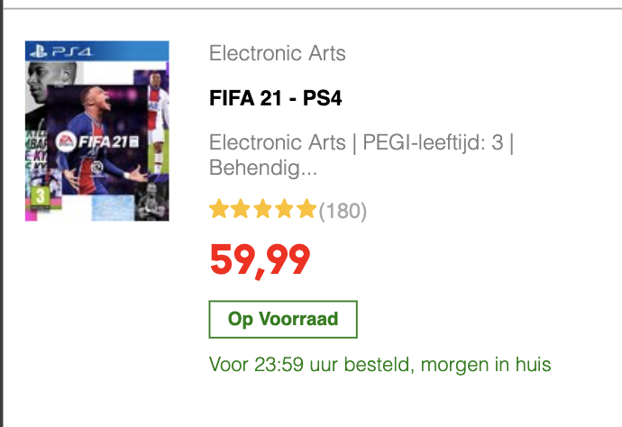

Dit is/was lastig:
Was even lastig om de sterretjes op zijn plek te krijgen, dat heb ik opgelost door de div eruit te halen en direct op de ul te stylen.
Font kreeg ik in eerste instantie niet helemaal, het is nu wel bold, maar nog niet tevreden met het eindresultaat. Ik ga nog verder zoeken.

-screenshot(s) van hoe ver je bent met korte uitleg-

Homepagina:

Wederom moet er nog voornamelijk herhaalde content worden toegevoegd.

Gamepagina:

De gamepagina is nu ongeveer 98% af. Er moeten nog 1 button worden toegevoegd en een klein lijstje bij de footer.

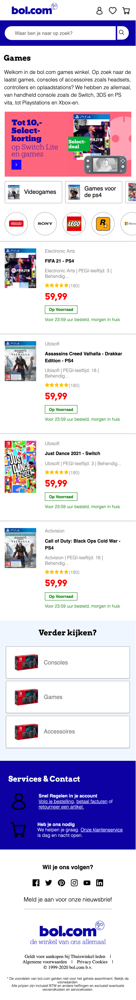

### Agenda voor meeting

-samen met je groepje opstellen-

| student 1: Anniek Baarse       | student 2: Gwyneth Schmitz                        | student 3: Chantal Valk                 | student 4        |
| ---                            | ---                                               | ---                                     | ---              |
|...                             | Categorie lijsten op de homepage...help           | ...                                     | en dan ik dat    |
|...                             | Hoe krijg ik het loepje in de zoekbalk?           | ...                                     | dit wil ik zeker |
|...                             |                                                   | ...                                     | ...              |

### Verslag van meeting

1. Mark heeft hetzelfde in zijn site zitten, hij raad aan een list in een list te maken met een class erop. Dit ga ik proberen, lukt dit niet mag ik hulp vragen bij Mark.
2. De button zit in het zoekformulier, niet ernaast. Dat ga ik proberen.

## Voortgang 1 (week 3)

### Stand van zaken

-dit ging goed & dit was lastig-
Dit ging goed: Ik ben enorm blij dat ik het scrollen naar de zijkant heb weten te fixen, ook d.m.v. tips vanuit de lessen.
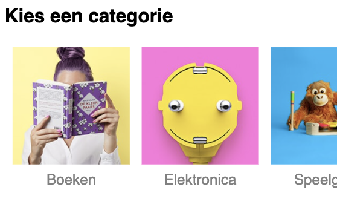

Dit is/was lastig:
Ik ben momenteel nog steeds aan het zoeken naar een oplossing om de images in het midden van de bolletjes te krijgen. Ik ben echter wel al een stapje dichterbij als vannochtend, nadat ik naar het vragenuurtje van de studentassistent Iris ben gegaan.

**Screenshot(s): 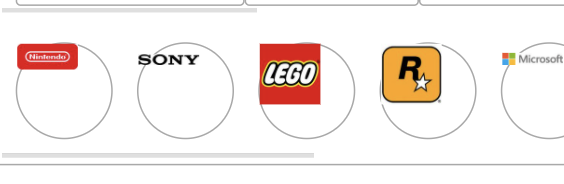

-screenshot(s) van hoe ver je bent met korte uitleg-
Homepagina:

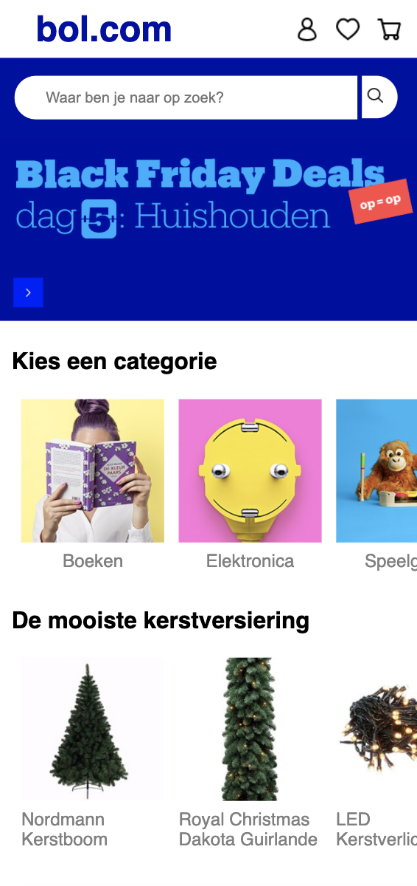 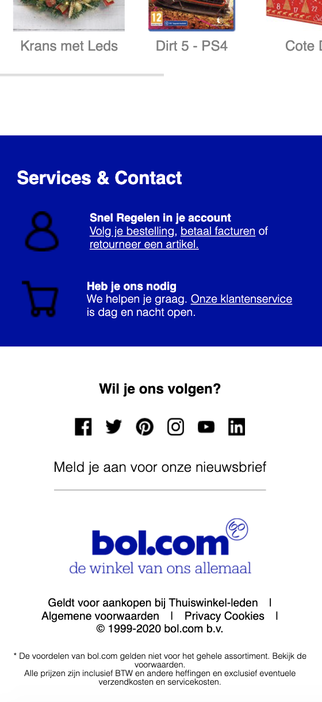

Ik moet nog veel invullen, maar het is veel herhaling van wat er nu al staat, dit komt dus wel goed.
Ik heb de header en footer grotendeels af. Ik moet hier nog naar de details kijken. Ook moet ik nog een hamburger menu maken, maar ik had vernomen dat dat niet zo belangrijk is als de content op de pagina.

Gamepagina:

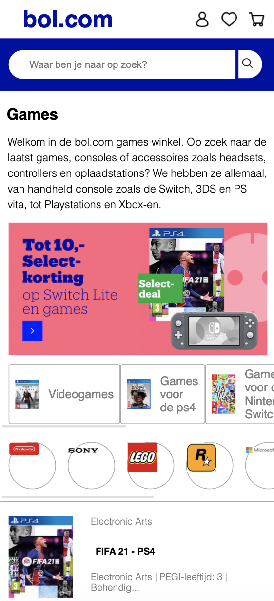 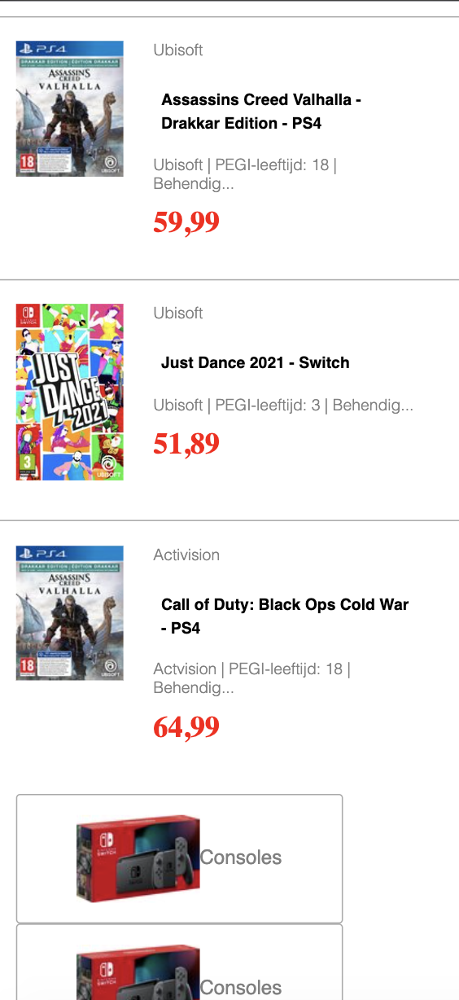
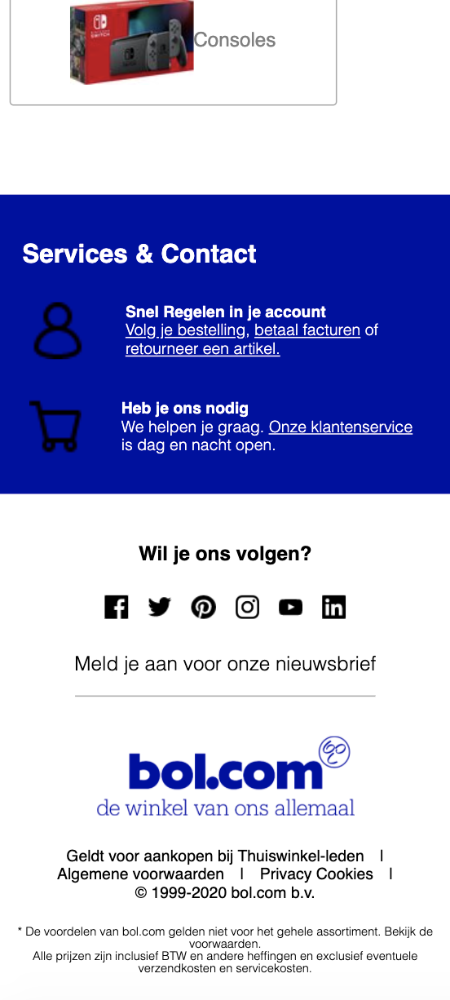

Hier wederom hetzelfde, veel invulwerk, maar dus ook veel herhaling van staande code. Ik moet hier de tweede slider, met de merken nog fixen en de onderkant van de pagina kan ook duidelijk nog wel wat werk gebruiken. 

### Agenda voor meeting

-samen met je groepje opstellen-

| student 1: Anniek Baarse       | student 2: Gwyneth Schmitz                        | student 3: Chantal Valk                 | student 4        |
| ---                            | ---                                               | ---                                     | ---              |
| De slider in de header.        | De afbeeldingen in de slider 2 op de gamepagina   | Hoe ik alles binnen de tijd ga afmaken. | en dan ik dat    |
| De breedte van de afbeeldingen.| Zoekbalk zonder streepje.                         | nog een punt                            | dit wil ik zeker |
| De footer die 2-koloms hoort.  | List items in slider 1 niet mooi.                 | ...                                     | ...              |

### Verslag van meeting

-1. Ik heb vernomen dat ik goed op weg ben. Hetgeen waar ik erg veel moeite mee heb is nogmaals de afbeeldingen in slider 2 goed krijgen. Ik heb met Iris gesproken in een apart vragenuurtje, hier gaf ze me al wat tips. Ik ben toen een stukje verder gekomen, maar nog net niet helemaal daar. Iris heeft mij tijdens de voortgang tips gegeven om object-position te gebruiken. Hier ga ik dan even naar kijken. (https://css-tricks.com/almanac/properties/o/object-position/). Mocht het allemaal echt niet lukken dan is mij geadviseerd om de afbeeldingen allemaal even groot te maken in photoshop. 

2. De zoekbalknop kan volgens Iris heel makkelijk gefixt worden door met padding en margins te spelen. Hier ga ik naar kijken.

3. Hetzelfde wat voor slider 2 geldt, geld voor slider 1. Ook hier ga ik mee aan de slag.

## Breakdownschets (week 1)
Typografie opdrachten: https://codepen.io/Kaazzey/pen/ZEOqyMM

Hieronder de semi-gedetailleerde schermschets voor de gamepagina van Bol.com

## Intake (week 1)
-uitwerken voor de kick-off werkgroep - begin van de eerste week-

**Je startniveau:** blauwe piste

**Je focus:** helemaal responsive

**Je opdracht:** Ik ga proberen https://www.bol.com/nl/ na te maken.

**Screenshot(s) van de eerste pagina (small screen):**

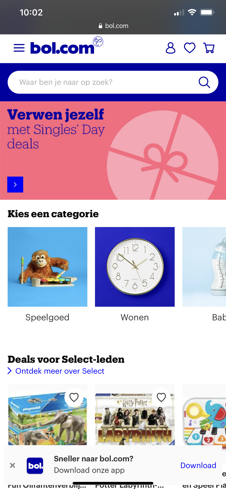

**Screenshot(s) van de tweede pagina (small screen):**

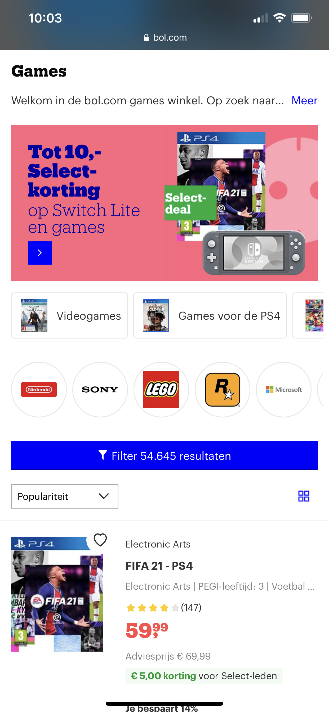
